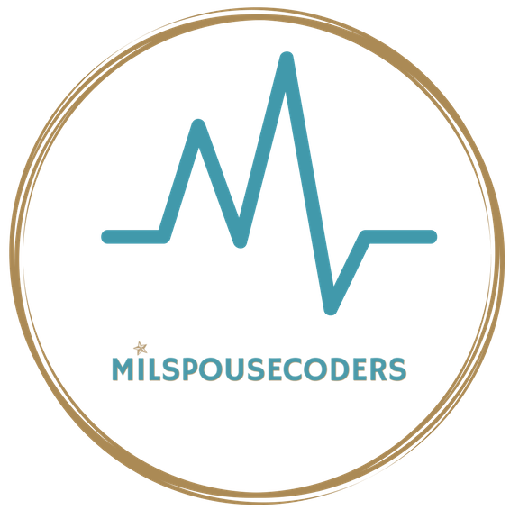

# About this Repo

This repo is geared toward first time contributors. There is no coding involved, only adding to a text file.
This repo will guide beginners on how to setup their personal machines with Git and how to contribute changes to an open source repository.

# Who is it geared toward?

This repository is geared toward first time contributors, specifically our MilSpouse Coders family.

# Let's get started!

-   Beginners: For instructions on how to set things up, please go to our [SETUP](SETUP.md) file.
-   If your machine is already setup and you're mostly familiar with Git and GitHub, please go directly to our [CONTRIBUTING](CONTRIBUTING.md) file.

# Disclaimer:

_This project is a teaching tool and doesn't not qualify for a Hacktoberfest PR._

#

This project was inspired by:
[First-Contributions](https://github.com/firstcontributions/first-contributions)

This project is licensed under the terms of the MIT license ([License](https://github.com/MilSpouseCoders/Hacktoberfest_2020#license)).
