# Setup instructions

Here you will find instructions on what software and tools you will need to install on your personal machine in order to contribute to our repositories.

There are many code editors and several ways of contributing to GitHub.  We will show you one way, but in the future you may find a way that you like better. That's perfectly fine -- contributing and working together is the end goal! For our project here we are going to have a specific set of instructions for _beginners_ to follow. That way, if you have any questions about the process along the way, we can help you with that specific step more easily.

## Step 1: Create a GitHub account


GitHub is an online service that stores code pushed to it from computers that have Git installed. Git is a version-control system for tracking changes in source code. It keeps track of what changed, what it was previously, who changed it, when it was changed, and why it was changed (because when we _commit_ (a fancy word for save) the changes, we write messages to explain the change). Git is a programmer's best friend!

-   If you don't have one, go to [GitHub](https://github.com/) and create your free account.
-   Think for a bit about your GitHub username (handle) -- you will likely not want to change it in the future, and you will probably want to include a link to your profile on your resume.  

## Step 2: Download Visual Studio Code


**At this point if you have Git setup and you'd prefer to use a different editor (other than Visual Studio Code), you can use the either of the instructions below to contribute to our repository.**

-   For instructions on how to contribute via the **Command Line**, please go [here](command-line-tutorial.md).
-   For instructions on how to contribute via **GitHub Desktop**, please go [here](github-desktop-tutorial.md).

There are many code/text edititors and IDE's (integrated development environment) out there, but for this project and others we are recommending you download [Visual Studio Code](https://code.visualstudio.com/download).

-   Why are we asking you to do this? If you need help with something and you're using an editor we haven't used before, it will be harder to help you. That being said, if you're comfortable using another code editor, by all means, use it!

## Step 3: Set up Git

To install git, go to the official [Git website](https://git-scm.com/downloads) with instructions on how to get it on your machine. Installation is different for Mac and Windows, so you'll have to follow the instructions for your operating system.

CodeCademy has basic installation instructions on their website [here](https://www.codecademy.com/articles/git-setup). This article has instructions for both Windows and Mac.

If you aren't sure if you have Git, run the following command in the Terminal (Mac) or Command Prompt (Windows):

`git --version`

This command will check your machine to see if you have Git installed and if you do, what version you're running.

If you already have Git, the command line will return the version number.

_For example:_

`git version 2.23.0`

## Step 4: Visual Studio Code Integrated Terminal

Visual Studio Code has an integrated terminal (like most IDE's) and that's what we will be using when sending our code to GitHub.

### Here are 2 ways to open the integrated terminal:

-   At the top of the IDE click **_Terminal -> New Terminal_**.

    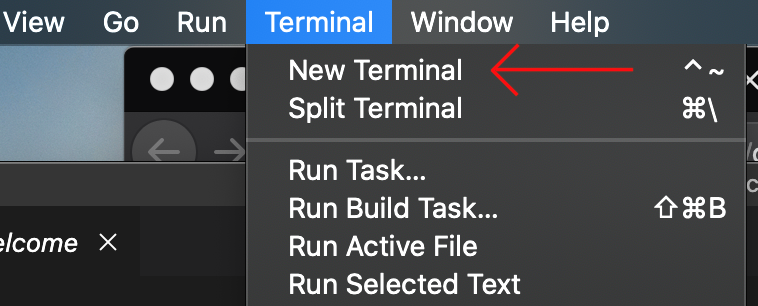

-   Type **_ctrl \`_** (the back tick button, usually on the key with the ~ (tilde)).

Since you should now have Git installed on your machine, run the `git --version` command in your VSC terminal. It should return the version installed. If you get a version number returned, then good job!

## Step 5: Fork the Hackathon_2020 repository

Now that you have everything installed, head to your favorite web browser and fork a copy of this repository by clicking on the **fork** button on the top right of the main page of the repository [here](https://github.com/MilSpouseCoders/Hacktoberfest_2020). (You should be logged into your GitHub account.)

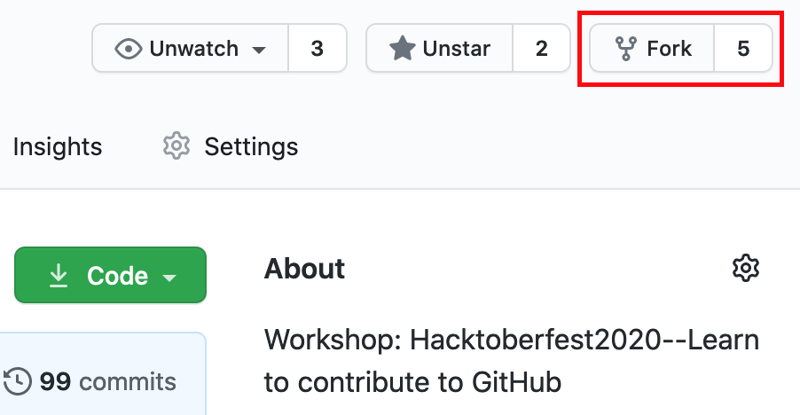

This will create a copy of this repository in your personal GitHub account that you can now work with. There are open source repositories all over the place, this allows people to collaborate on programs and projects. So if you find other repositories you like, fork those and take a look at the code! The next step will tell you how to download that code onto your own machine so you can run the programs yourself.

## Step 6: Clone the Hackathon_2020 repository to your machine

Go to your _personal_ GitHub account and click on the forked copy of the repository that should now be listed. \**Important: If you check the link of the page you are on, it should be ```https://github.com/<your-github-handle>/Hacktoberfest_2020```. In this style of contribution, we fork from the main repository, and clone (copy the code) to our computer from our personal fork.

Click on the green **Code** button.

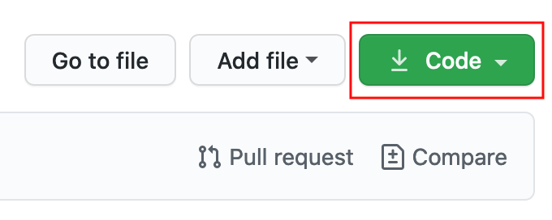

Click the _copy to clipboard_ icon or highlight and copy the listed url.

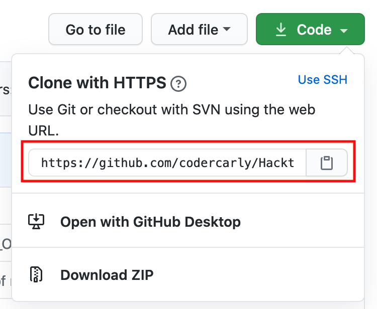

**In the Visual Studio Code integrated terminal run the following git command:**

```
git clone <url you just copied>
```

**Note: Don't type the brackets--this is just a way to show that you're supposed to replace that phrase with something, and give a hint as to what goes there; in this case you will paste the URL you just copied from your GitHub account.**

_For example:_

```
git clone https://github.com/your-github-handle/hacktoberfest_2020.git
```

where `your-github-handle` is your GitHub username. In this step you're copying the contents of the hacktoberfest_2020 repository on GitHub to your computer.

As soon as the cloning process is finished, the cloned files should be available to you in Visual Studio Code within the Explorer:

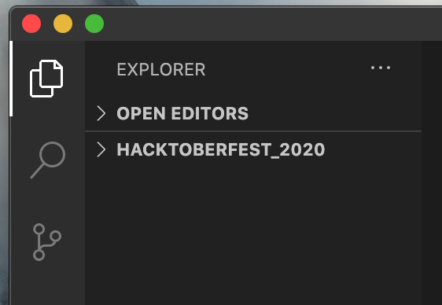

Click the arrow to the left of _Hacktoberfest_2020_ to look at the files. You have successfully cloned a repo to your machine!

## Step 7: Set the Origin and create a Branch

#### Check the Origin

When you send your file changes from your local computer to your personal GitHub you have to make sure your computer knows where to send the changes. In Git, that's called setting the "origin". The "origin" is a shorthand name for the default remote repository.  In our case, this should be the repository the project was originally cloned from (which was done in step #5). But we will check just to make sure.

First, run the command ```git remote -v``` to check if the origin is set.

Because you cloned the repo from GitHub in step 5, the location of the clone should be set.

Hopefully your output from running ```git remote -v``` looks like this (don't worry about the upstream lines for now):

```
origin https://github.com/your-github-handle/Hacktoberfest_2020.git (fetch)
origin https://github.com/your-github-handle/Hacktoberfest_2020.git (pull) 
upstream        https://github.com/MilSpouseCoders/Hacktoberfest_2020.git (fetch)
upstream        https://github.com/MilSpouseCoders/Hacktoberfest_2020.git (push)  
```

If the origin is not set at this point, go to your copy of the repo on your personal GitHub page and click the green **Code** button and copy the URL. Then in the integrated terminal type:

```git remote add origin <url you copied>```

Now, run ```git remote -v``` again to check the origin.

#### Create a Branch

Next, you're going to create a branch for you to work on. This way, you're not working on the master branch.

In the Visual Studio Code integrated terminal, create a branch using the `git checkout` command:

```
git checkout -b <add-your-new-branch-name>
```

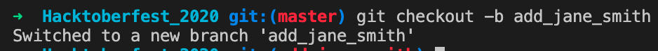

(The name of the branch does not need to have the word _add_ in it, but it's a reasonable thing to include because the purpose of this branch is to add your name to a list.)

This will create a new branch and automatically move you to your new branch. You're checking out the new branch you created!
You should now have 2 branches: a master branch and the branch you just created.

To check the branches type:

`git branch`

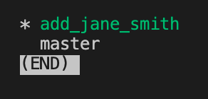

A list of the branches you currently have should appear. If you are not automatically directed back to the terminal prompt, hit the **"q"** on your keyboard to exit out of the branch list. That will "quit" you from the window and take you back to the terminal.

## Step 8: Make the necessary changes and Commit those changes

Now double click on the `first_duty_station.md` file to open it up in VSC. 

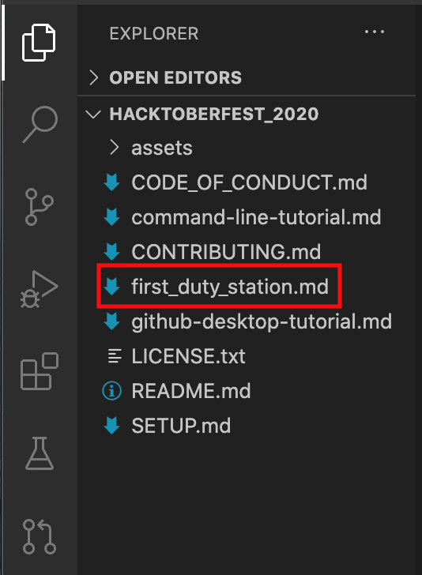

There are instructions at the top of the file on what you need to do. Make your addition to the file and **be sure to save it!** After you save the file you will see that the file itself in the file Explorer has changed colors.

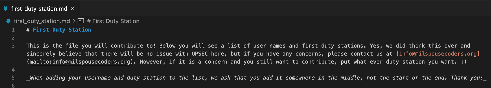

In the integrated terminal, type the command `git status`, you'll see there are changes.

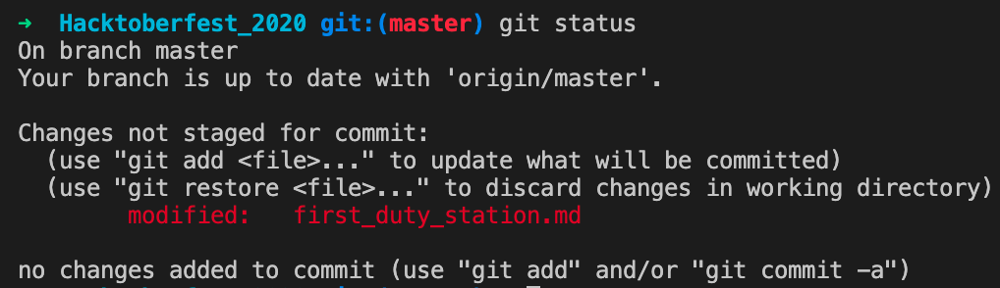

It says there are "changes not staged to commit" and to use "git add <file>" to update what will be committed. So lets do that!
To stage those changes to the branch you created, use the `git add` command:

```
git add first_duty_station.md
```

Now it's time to commit (save) those changes using the `git commit` command:

```git commit -m "Add <your-github-handle> to first_duty_station list"```

replacing `<your-github-handle>` with your github username. The "-m" stands for message and the text in the quotes is the message. These messages are important, so always make sure you write thoughtful and concise messages about the changes you made to a file.

## Step 9: Push your changes to your GitHub

Now, you have to send the changes you made to your personal GitHub account.

Push your changes using the command `git push`:

```
git push origin <add-your-branch-name>
```

replacing `<add-your-branch-name>` with the name of the branch you created earlier.

## Step 10: Submit your changes for review

Now the goal is to get your changes added to the original repository that is maintained by someone else.

To do that go to your personal GitHub account, click _repositories_, and select the repository you're working with. You'll see a `Pull Request` tab at the top.


Click on that tab and then click the green _Create Pull Request_ button.

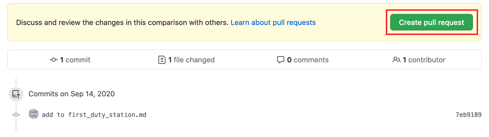

Make sure it has a subject typed in and add any comments if necessary. Click _Create Pull Request_ one more time.

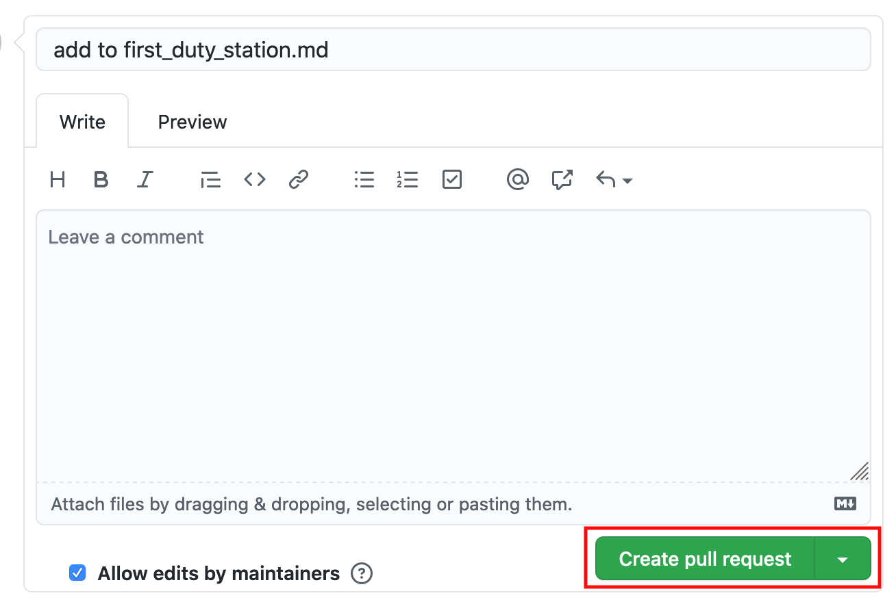

That's it!
Soon we'll be merging all your changes into the master branch of this project. You will get an email notification once the changes have been merged.

### Delete your Branch
You can now delete the branch you made on your local machine.

In VSC within the integrated terminal type ```git branch``` . The branch you have been working on should be highlighted and the list will show the branch "master" as well. Hit "q" to quit. Git will not allow you to delete the branch you are working on, so you have to switch back to the master.

Type:

```git checkout master```

This will switch you back to the master branch. Run ```git branch``` again to make sure the master branch is highlighted now. Then "q" to quit.

To delete the branch you were working on, type:

```git branch -d <branch name>``` (Where the branch name is the name of the branch you created.)

The -d option will delete the branch only if it has already been pushed and merged with the remote branch. Use -D instead if you want to force the branch to be deleted, even if it hasn't been pushed or merged yet. For example, ```git branch -D <branch name>```.

## Where to go from here?

Congrats! You just completed the standard _fork -> clone -> edit -> PR_ workflow that you'll encounter often as a contributor!

Want to do another one? Check out the [MSC-Coding-Resources](https://github.com/MilSpouseCoders/MSC-Coding-Resources) project!

## Additional info:

[More info on git installation and setup](https://docs.github.com/en/github/getting-started-with-github/set-up-git)
