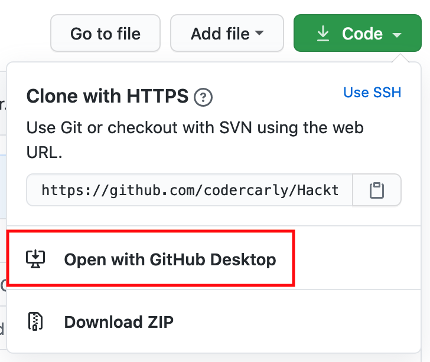

# Making your first contribution using Github Desktop

## 1. Complete steps 1-3 in README.MD

Be sure you have completed steps 1 - 3 in the [README.MD](README.md) file.

## 2. Fork this repository

Fork this repository by clicking on the **fork** button on the top right of the main page of the repository [here](https://github.com/MilSpouseCoders/Hacktoberfest_2020).
This will create a copy of this repository in your personal GitHub account.

## 3. Clone the repository to your machine

Go to your _personal_ GitHub account and click on the forked copy of the repository that should now be listed. Click on the green **Code** button.

To clone the repo, click on "Code" and then click on "Open with GitHub Desktop".

At this point, if you do not have GitHub Desktop installed, install it. If it is already installed, a pop up window will ask you if you want to use GitHub Desktop to open the link, select "open" or "open link".

The contents will be downloaded to your computer.

Now you have copied the contents of the hacktoberfest_2020 repository in GitHub to your personal computer.

## 4. Create a branch

Now create a branch by clicking on the "Current branch" icon at the top and then click on "New branch":

Name your branch <add-your-github-handle>. For example, "add-james-smith"

Click on `Create branch`

## 5. Make necessary changes and commit those changes

Now open `first_duty_station.md` file in a text editor, and follow the instructions on what to do.

Example: If your GitHub handle is jamessmith, It should look like this:

[//]: # "TODO: new image of what ours will look like"

You can see that there are changes to 'first_duty_station.md' and they have been added to the Github Desktop.

Now commit those changes:

-   Write the message "Add `<your-github-handle>` to first_duty_station.md" in the _summary_ field.

-   Replace `<your-github-handle>` with your GitHub handle.

-   Click on the button that says `Commit to add-your-github-handle`.

At the bottom, you can see that the commit has been created.

## 6. Push changes to github

Click on File->Options and sign-in to Github.com. Type in your Github username and password.

Click the `Publish` button on the top right.

## 7. Submit your changes for review

Now go to your personal GitHub account, click _repositories_, and select the repository you're working with. You'll see a `Pull Request` tab at the top.

Click on that tab and then click the green _Create Pull Request_ button.

Make sure it has a subject typed in and add any comments if necessary. Click _Create Pull Request_ one more time.

That's it!
Soon we'll be merging all your changes into the master branch of this project. You will get a email notification once the changes have been merged.

## Where to go from here?

Congrats! You just completed the standard _fork -> clone -> edit -> PR_ workflow that you'll encounter often as a contributor!

[//]: # "TODO: Social media something for our members to share"

Celebrate your contribution and share it with your friends and followers by going to:

[//]: # "TODO: slack invite to MSC"

You can join our slack team in case you need any help or have any questions. [Join slack team]

[//]: # "TODO: MSC-curated contribution list"

Now let's get you started with contributing to other projects. We've compiled a list of projects with easy issues you can get started on. Check out [the list of projects in web app](https://roshanjossey.github.io/first-contributions/#project-list).
