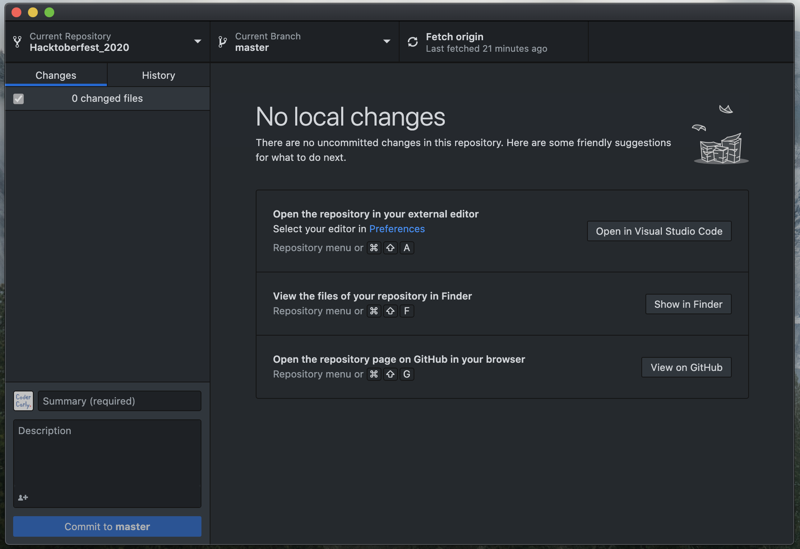
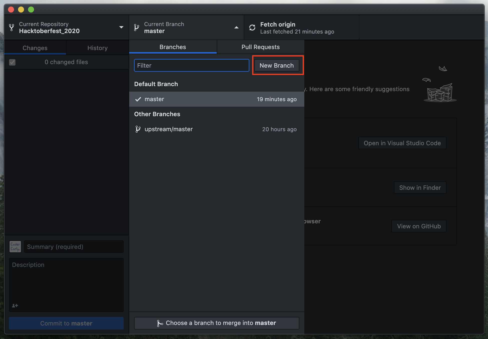
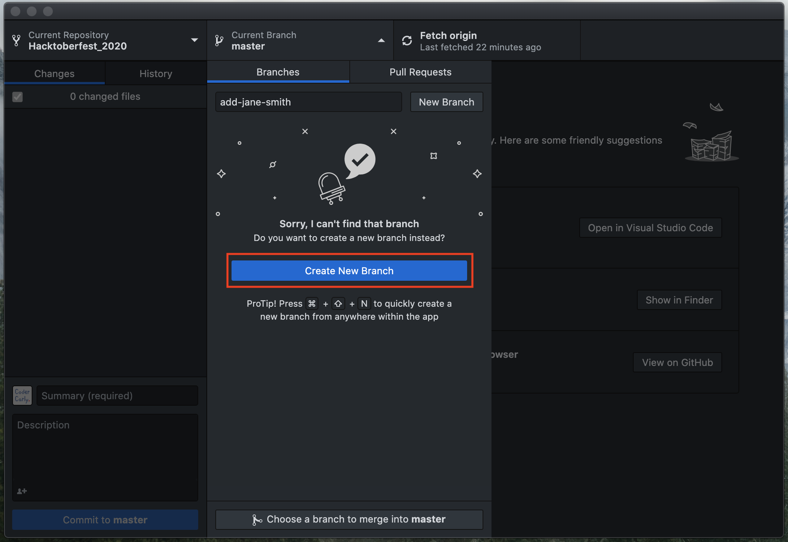
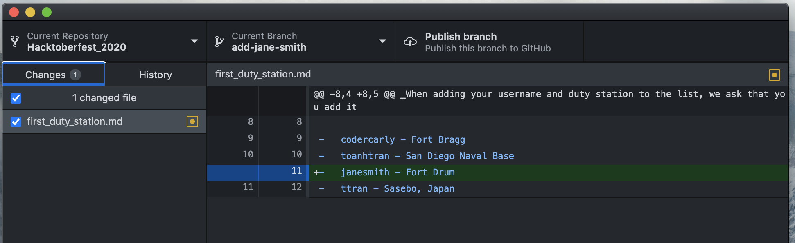
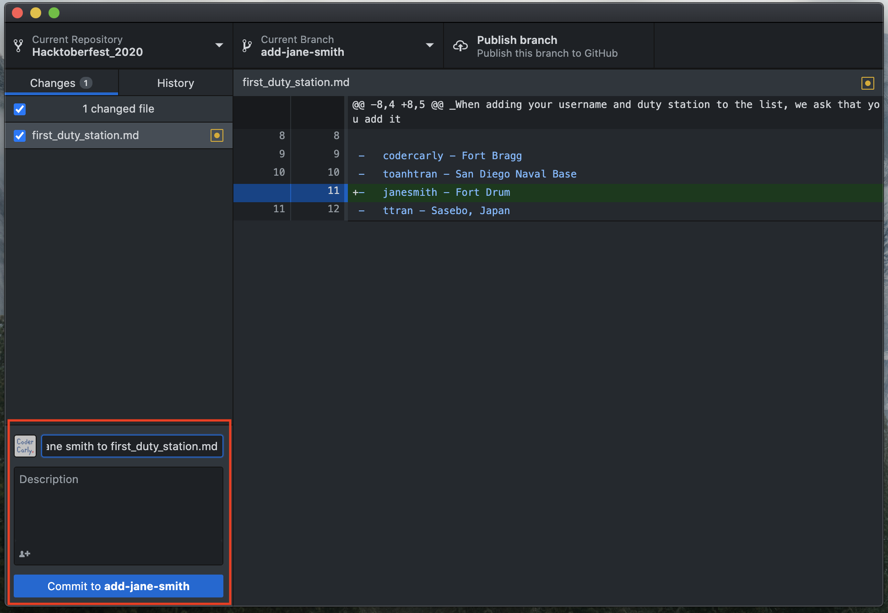
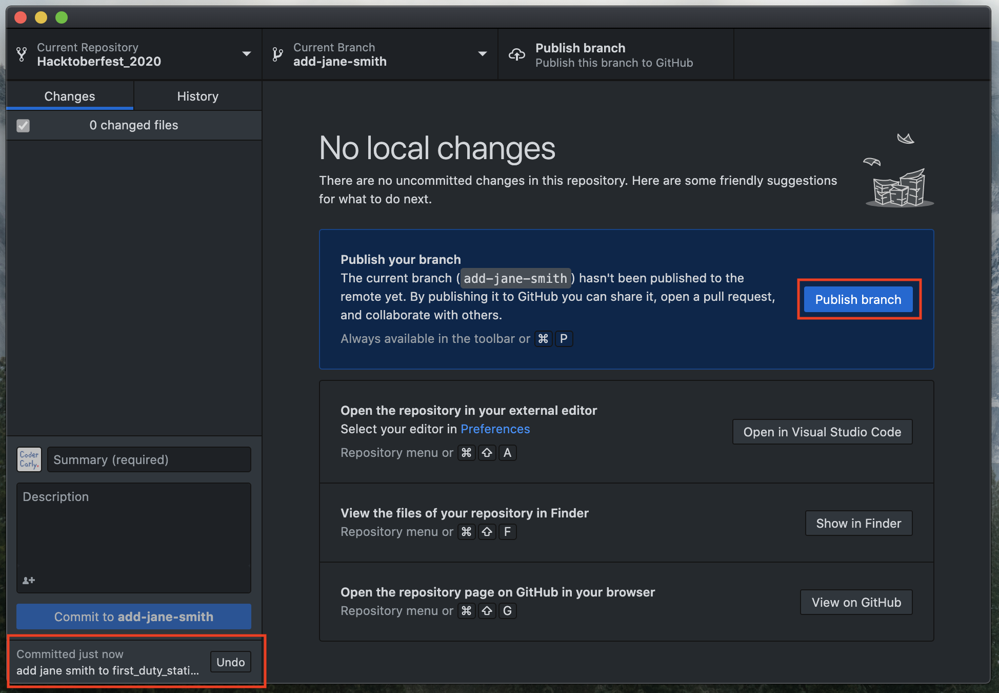
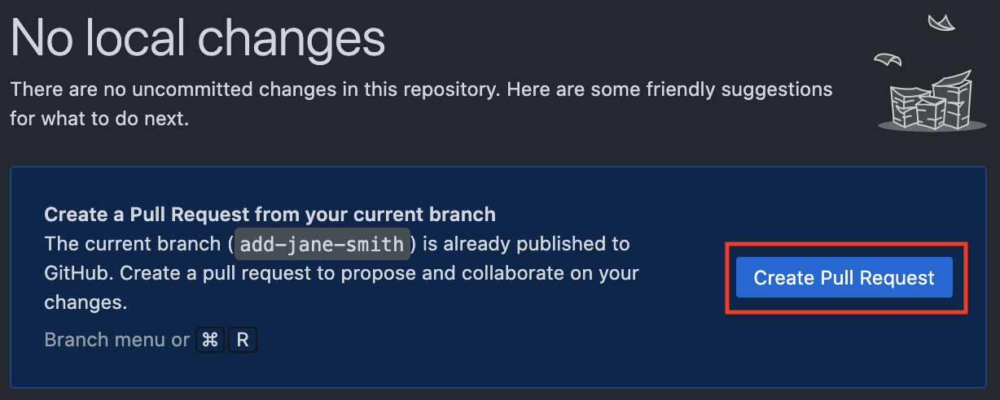

# Making your first contribution using Github Desktop

## 1. Complete steps 1-3 in README.MD

Be sure you have completed steps 1 - 3 in the [README.MD](README.md) file.

## 2. Fork this repository

Fork this repository by clicking on the **fork** button on the top right of the main page of the repository [here](https://github.com/MilSpouseCoders/Hacktoberfest_2020).
This will create a copy of this repository in your personal GitHub account.

## 3. Clone the repository to your machine

Go to your _personal_ GitHub account and click on the forked copy of the repository that should now be listed. Click on the green **Code** button.

To clone the repo, click on **Open with GitHub Desktop** button.

At this point, if you do not have GitHub Desktop installed, install it. If it is already installed, a pop up window will ask you if you want to use GitHub Desktop to open the link, select "open" or "open link".

The contents will be downloaded to your computer.

Now you have copied the contents of the Hacktoberfest_2020 repository in GitHub to your personal computer.

## 4. Create a branch

Now create a branch by clicking on the **Current Branch** icon at the top and then click on **New Branch**:

Click on **Create New Branch**

Name your branch <add-your-github-handle>. For example, "add-jane-smith" and click **Create Branch** to finish.

## 5. Make necessary changes and Commit those changes

Now open _first_duty_station.md_ file in a text editor, and follow the instructions on what to do.

**Be sure to save the file!**

In GitHub Desktop, the _Changes_ tab should update and the right hand side will show the file.

You can see that there are changes to _first_duty_station.md_ and they have been added to the Github Desktop. The **green** highlighted line and the **plus** to the left that shows that it's an addition to the file. If the line was **red** there would be a **minus** sign, that would mean the item is being removed from the file.

Now, it's time to Commit the changes to your GitHub repository.
Write a message in the bottom left box explaining what you're committing. In this case, "add jane smith to first_duty_station.md". Then click the button below to **Commit to add-jane-smith** (that will vary based on what you named your branch).

At the bottom left, you can see that the commit has been created.

## 6. Push changes to GitHub

Next you want to push those changes to your personal GitHub account, so click **Publish branch**. If you get a message to log in to your GitHub account, do that now.

## 7. Submit your changes for review

The final step is to create your pull request. You can start that here by clicking the **Create Pull Request** button.

Your personal GitHub account will open directly to the Pull Request option on your repo. Click the green _Create Pull Request_ button.

Make sure it has a subject typed in and add any comments if necessary. Click _Create Pull Request_ one more time.

That's it!
Soon we'll be merging all your changes into the master branch of this project. You will get a email notification once the changes have been merged.

## Where to go from here?

Congrats! You just completed the standard _fork -> clone -> edit -> PR_ workflow that you'll encounter often as a contributor!

[//]: # "TODO: Social media something for our members to share"

Celebrate your contribution and share it with your friends and followers by going to:

[//]: # "TODO: slack invite to MSC"

You can join our slack team in case you need any help or have any questions. [Join slack team]

[//]: # "TODO: MSC-curated contribution list"

Now let's get you started with contributing to other projects. We've compiled a list of projects with easy issues you can get started on. Check out [the list of projects in web app](https://roshanjossey.github.io/first-contributions/#project-list).
